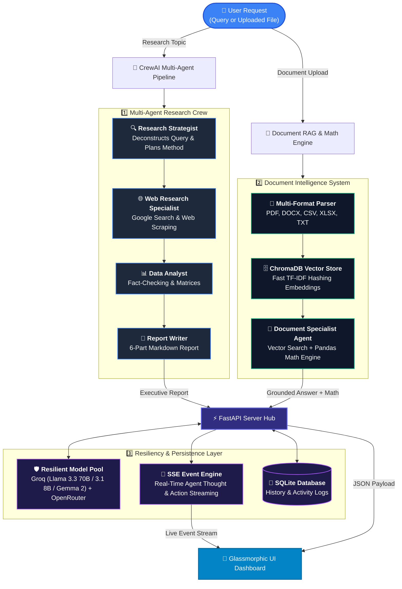

# ⚡ AgentForge — Autonomous Multi-Agent AI System & Document RAG Platform

<p align="center">
  
  
  
  
  
  
  
  
  
  [](https://agentforge-1.streamlit.app/)
</p>

<p align="center">
  An enterprise-grade, autonomous <b>Multi-Agent AI System</b> and <b>Document RAG Platform</b> where specialized AI agents collaborate in sequential pipelines to research complex topics, perform live web search & scraping, process multi-format documents (PDF, DOCX, CSV, XLSX, TXT), execute grounded vector RAG search & Pandas mathematical computations, and produce executive-ready markdown reports — streamed live via Server-Sent Events (SSE).
</p>

<p align="center">
  <a href="#-overview">Overview</a> •
  <a href="#-key-features">Key Features</a> •
  <a href="#%EF%B8%8F-system-architecture">System Architecture</a> •
  <a href="#-the-multi-agent-crew">Multi-Agent Crew</a> •
  <a href="#-document-rag--math-engine">Document RAG & Math</a> •
  <a href="#-technology-stack">Tech Stack</a> •
  <a href="#-environment-variables-configuration">Configuration</a> •
  <a href="#-quick-start--installation">Quick Start</a> •
  <a href="#-api-reference">API Reference</a> •
  <a href="#-repository-structure">Repo Structure</a> •
  <a href="#-troubleshooting--faqs">FAQ</a>
</p>

---

## 📖 Overview

**AgentForge** is an end-to-end, state-of-the-art Multi-Agent Autonomous Research & Document Intelligence Platform built on **CrewAI**, **FastAPI**, **ChromaDB**, and **Groq/Gemini/OpenRouter LLMs**.

Rather than relying on a single monolithic LLM prompt, AgentForge coordinates a team of specialized AI agents—each possessing distinct roles, goals, backstories, and specialized tools. Whether conducting comprehensive market research, synthesizing web intelligence across dozens of live sources, or performing vector search and deterministic mathematical computations on multi-format enterprise files (PDF, DOCX, CSV, XLSX, TXT), AgentForge delivers structured, fact-checked, executive-level reports in real time.

---

## 🌟 Key Features

### 🤖 1. Autonomous 4-Agent Research Crew
* **Research Strategist**: Analyzes the research topic, decomposes queries into sub-questions, and formulates a multi-vector research plan.
* **Web Research Specialist**: Conducts targeted live Google searches via `SerperDevTool` and scrapes web page content with `ScrapeWebsiteTool`.
* **Data Analyst**: Categorizes raw research, fact-checks web findings, detects patterns, and synthesizes structured comparison matrices.
* **Report Writer**: Compiles analyzed findings into a 6-part executive report (800-1200 words) complete with practical recommendations and cited source links.

### 📄 2. Intelligent Document RAG & Math Engine
* **Multi-Format Ingestion**: Native parsing for `.pdf`, `.docx`, `.csv`, `.xlsx`, and `.txt` files.
* **Isolated Vector Stores**: Each uploaded file receives its own isolated ChromaDB collection to prevent cross-document data leakage.
* **API-Free Fast Embeddings**: Implements a zero-cost `FastTFIDFEmbeddingFunction` using Scikit-Learn `HashingVectorizer` (L2 norm) that runs 100% locally without PyTorch or C++ runtime DLL dependencies.
* **Deterministic Math Tool**: Features a custom Pandas-driven `MathComputationTool`. The Document Agent **never estimates math**—it executes exact Python arithmetic expressions for sums, averages, row filtering, min/max, and statistical distributions over tabular data.

### ⚡ 3. Multi-Tier Model Fallback & Resiliency
* **Auto-Failover Pool**: Intelligent candidate model ordering across **Groq (Llama 3.3 70B, Llama 3.1 8B, Gemma 2 9B, Llama 3.2 Vision, Mixtral 8x7B, DeepSeek R1, Qwen 2.5)** and **OpenRouter Free Models**.
* **Rate-Limit & Cooldown Management**: Automatically captures `429 Rate Limit` / `413 / Quota Exceeded` errors, parses server retry delays, applies exponential backoff, and temporarily quarantines exhausted models for 60-second cooldowns before falling over.

### 🌐 4. Multilingual Intelligence Engine
* Automatic language detection supporting **Hinglish** (Hindi + English mix), **Hindi** (Devanagari), **Spanish**, **French**, **German**, **Japanese**, **Korean**, **Portuguese**, **Italian**, **Arabic**, **Chinese**, **Bengali**, **Tamil**, **Telugu**, **Marathi**, and **Urdu**.
* Enforces strict language output across headings, tables, body text, and recommendations.

### 📡 5. Real-Time Server-Sent Events (SSE) Streaming
* Streams agent thoughts, search queries, scraping steps, tool invocations, and completion states live to the web frontend using `sse-starlette` without requiring page reloads or main thread blocking.

### 🎯 6. Multi-Depth Execution Modes
* **Quick Mode** (`~1 min` • 2 Tasks): Ultra-fast execution pipeline (Scraper → Writer).
* **Detailed Mode** (`~2 min` • 3 Tasks): Balanced execution pipeline (Scraper → Analyst → Writer) covering 5-7 core aspects.
* **Deep Dive Mode** (`~4 min` • 4 Tasks): Exhaustive pipeline (Strategist → Scraper → Analyst → Writer) addressing 8-10 aspects, sub-questions, and edge cases.

### 🎨 7. Modern Glassmorphic Dark-Mode Dashboard
* Built with pure HTML5, Vanilla CSS3, and ES6 JavaScript (Zero heavy node frameworks).
* Features tab navigation between **AI Research Studio** and **Document Analyzer**, live agent activity streams, interactive report viewers, session history controls, and file export/copy capabilities.

### 🖼️ 8. Dynamic AI Image Generation
* Integrated free image generation tool powered by Pollinations AI for embedding high-resolution visual graphics into generated reports.

### 💾 9. Persistent SQLite Database
* Stores session metadata, task statuses, execution durations, agent thought logs, generated reports, document upload histories, and vector chunk statistics in `agentforge.db`.

---

## 🏗️ System Architecture

AgentForge is built around a decoupled dual-engine architecture: an **Autonomous Multi-Agent Web Research Crew** and a **Grounded Document RAG & Math Engine**, orchestrated via FastAPI and streamed live to the frontend.



### 🔁 Execution Pipeline & Data Flow

| Component | Responsibility & Workflow | Key Technologies |
| :--- | :--- | :--- |
| **1. Dual Input Router** | Routes user input dynamically to either the Autonomous Multi-Agent Research Crew or the Document Intelligence RAG Engine. | FastAPI, Pydantic |
| **2. Autonomous Multi-Agent Crew** | Sequential 4-agent pipeline (**Strategist → Specialist → Analyst → Writer**) that plans, searches the web live via Serper, fact-checks, and synthesizes reports. | CrewAI, SerperDev API, Web Scraper |
| **3. Document RAG & Math Engine** | Parses uploaded documents (`.pdf`, `.docx`, `.csv`, `.xlsx`, `.txt`), creates isolated ChromaDB vector collections with API-free embeddings, and executes deterministic Pandas math. | ChromaDB, Scikit-Learn `HashingVectorizer`, Pandas |
| **4. Resiliency & Model Fallback** | Monitors API calls for rate limits (429/413), automatically retries with backoff, and fails over across Groq & OpenRouter model pools. | Custom Resilient LLM Wrapper |
| **5. Live SSE Engine & Storage** | Captures agent steps in real time and pushes SSE events to the browser dashboard while persisting full session logs in SQLite. | `sse-starlette`, SQLite3 |

---

## 🤖 The Multi-Agent Crew

| Agent | Icon | Primary Role | Description & Responsibilities | Assigned Tools |
| :--- | :---: | :--- | :--- | :--- |
| **Research Strategist** | 🔍 | Research Director | Formulates research methodology, decomposes topics into core sub-questions, and defines outline structure. | High-Level Reasoning |
| **Web Research Specialist** | 🌐 | OSINT Collector | Executes Google searches, scrapes target web pages, extracts key statistics, and tracks source URLs. | `TruncatedSerperTool`, `TruncatedScrapeTool` |
| **Data Analyst** | 📊 | Information Structurer | Groups raw web data into categories, builds comparative matrices, validates facts, and identifies key trends. | Markdown Matrix Builder |
| **Report Writer** | 📝 | Executive Synthesizer | Compiles all findings into a structured 6-part executive report with clear headings and actionable recommendations. | Report Formatting Engine |
| **Document Specialist** | 📑 | Grounded QA & Math | Answers questions strictly based on uploaded document vector context and performs math calculations. | `VectorSearchTool`, `MathComputationTool` |

---

## 📄 Document RAG & Math Engine

The **Document Analyzer** pipeline processes complex files with complete accuracy:

```
[ Upload File ] ──► [ Text/Table Extraction ] ──► [ Overlapping Chunking ] ──► [ ChromaDB Ingestion ]
                                                                                      │
[ User Question ] ◄── [ Grounded Answer Synthesis ] ◄── [ Vector Retrieval / Math ] ◄──┘
```

### Key Technical Capabilities:
1. **Multi-Format Extraction**:
   - `.pdf`: Extracted using `pypdf`, retaining section boundaries.
   - `.docx`: Extracted via `python-docx`, maintaining paragraph and header structures.
   - `.csv` & `.xlsx`: Ingested into Pandas DataFrames, extracting schema summaries and numerical column metrics.
   - `.txt`: Clean text chunking with 50-word overlaps.
2. **Exact Mathematical Computation**:
   When users ask numerical or analytical questions (*e.g., "What was the total expenditure in 2023?"* or *"What is the mean value of column B?"*), the Document Agent invokes the `MathComputationTool`, executing real Python Pandas arithmetic expressions rather than generating approximate text estimates.

---

## 🛠️ Technology Stack

| Category | Technologies |
| :--- | :--- |
| **Backend & Server** | Python 3.10+, FastAPI, Uvicorn, Asyncio, Threading |
| **Agent Framework** | CrewAI (Sequential Process Engine, Step & Task Callbacks) |
| **LLM Infrastructure** | Groq API (`Llama 3.3 70B`, `Llama 3.1 8B`, `Gemma 2 9B`), OpenRouter, Google Gemini |
| **Vector DB & RAG** | ChromaDB (Persistent Storage), Scikit-Learn `HashingVectorizer` (Fast TF-IDF) |
| **Document Parsing** | Pandas, PyPDF, python-docx, openpyxl |
| **Database & Storage** | SQLite3 (`agentforge.db`), Local Disk Storage (`uploads/`) |
| **Search & Scraping** | SerperDev API (`google-search-results`), ScrapeWebsiteTool |
| **Streaming** | Server-Sent Events (`sse-starlette`) |
| **Frontend UI** | HTML5, Vanilla CSS3 (Glassmorphic Design System), Modern Vanilla JavaScript |

---

## ⚙️ Environment Variables Configuration

Create a `.env` file in the root directory:

```env
# Required Primary API Keys
GROQ_API_KEY=gsk_your_groq_api_key_here
SERPER_API_KEY=your_serper_api_key_here

# LLM Selection (Default: groq/llama-3.3-70b-versatile)
MODEL_NAME=groq/llama-3.3-70b-versatile

# Optional Resiliency Backup API Keys
GEMINI_API_KEY=your_gemini_api_key_here
OPENROUTER_API_KEY=your_openrouter_api_key_here

# Telemetry Opt-Out
ANONYMIZED_TELEMETRY=False
CREWAI_TELEMETRY_OPT_OUT=true
```

> [!TIP]
> **API Key Setup Links**:
> - Get a free Groq API key at **[console.groq.com](https://console.groq.com)**
> - Get a free Serper Search key (2,500 free queries) at **[serper.dev](https://serper.dev)**
> - Get a free Gemini API key at **[aistudio.google.com](https://aistudio.google.com)**

---

## 🚀 Quick Start & Installation

### 1. Prerequisites
* **Python 3.10** or higher
* **Git**

### 2. Clone the Repository
```bash
git clone https://github.com/Aniketyadav29/AgentForge.git
cd AgentForge
```

### 3. Create & Activate Virtual Environment

* **On Windows (PowerShell/CMD):**
  ```powershell
  python -m venv venv
  .\venv\Scripts\activate
  ```

* **On macOS / Linux:**
  ```bash
  python3 -m venv venv
  source venv/bin/activate
  ```

### 4. Install Dependencies
```bash
pip install -r requirements.txt
```

### 5. Launch the FastAPI Server
```bash
python main.py
```
*or using uvicorn directly:*
```bash
uvicorn main:app --reload --host 127.0.0.1 --port 8000
```

### 6. Access the Dashboard
Open your browser and navigate to:
```
http://localhost:8000
```
Interactive OpenAPI documentation is available at `http://localhost:8000/docs`.

---

## 📡 API Reference

### Web Research Endpoints

| Method | Endpoint | Description | Request Payload / Params |
| :--- | :--- | :--- | :--- |
| `POST` | `/api/research` | Submit a research query to start agent crew | `{ "topic": "str", "depth": "quick\|detailed\|deep", "focus_areas": ["str"] }` |
| `GET` | `/api/research/{task_id}/stream` | SSE endpoint for real-time agent thought logs | N/A (EventStream) |
| `GET` | `/api/research/{task_id}/result` | Fetch completed research report | N/A |
| `GET` | `/api/history` | List past research sessions | `?limit=50&offset=0` |
| `GET` | `/api/history/{task_id}` | Retrieve details of a specific past report | N/A |
| `DELETE`| `/api/history/{task_id}` | Delete a past research session | N/A |

### Document RAG & Math Endpoints

| Method | Endpoint | Description | Request Payload / Params |
| :--- | :--- | :--- | :--- |
| `POST` | `/api/documents/upload` | Upload and index a document (`.pdf`, `.docx`, `.csv`, `.xlsx`, `.txt`) | `multipart/form-data` (`file`) |
| `POST` | `/api/documents/{doc_id}/query` | Query an uploaded document (grounded QA or math computation) | `{ "question": "str" }` |
| `GET` | `/api/documents` | List all uploaded and indexed documents | N/A |
| `DELETE`| `/api/documents/{doc_id}` | Delete document session and vector store collection | N/A |

### Health & System Endpoints

| Method | Endpoint | Description | Response |
| :--- | :--- | :--- | :--- |
| `GET` | `/health` | Server health check and active session count | `{ "status": "healthy", "version": "1.0.0", "active_sessions": int }` |
| `GET` | `/` | Serves the main Glassmorphic web dashboard | HTML Content |

---

## 📁 Repository Structure

```
AgentForge/
├── .env                    # Environment variables & API keys
├── .gitignore              # Git exclusions
├── README.md               # Project documentation
├── requirements.txt        # Python package requirements
├── main.py                 # FastAPI server & route handlers
├── agentforge.db           # SQLite database (auto-generated)
├── agents/                 # Multi-Agent Core Engine
│   ├── __init__.py
│   ├── agents.py           # Agent definitions & multi-model fallback resiliency
│   ├── crew.py             # Crew orchestration engine & activity logger
│   ├── tasks.py            # Task definitions & language directives
│   ├── tools.py            # Search, web scraping & AI image generation tools
│   ├── vector_store.py     # ChromaDB manager with HashingVectorizer embeddings
│   ├── document_agent.py   # Grounded document specialist agent
│   ├── file_parser.py     # Multi-format document parser (PDF, DOCX, CSV, XLSX, TXT)
│   └── math_tools.py      # Pandas-based mathematical execution tool
├── database/
│   └── db.py               # SQLite database setup & CRUD helper functions
├── models/
│   └── schemas.py          # Pydantic schemas for API request/response validation
├── static/                 # Frontend Web Application
│   ├── index.html           # Main Glassmorphic web interface layout
│   ├── css/
│   │   └── styles.css       # Custom Glassmorphic design system
│   └── js/
│       ├── app.js           # Frontend state manager & API client
│       ├── agents-panel.js  # Real-time SSE agent activity renderer
│       └── report-viewer.js # Markdown report viewer, copy & export controller
├── chroma_db/              # Persistent ChromaDB vector database directory
└── uploads/                # Document storage directory
```

---

## 💡 Troubleshooting & FAQs

<details>
<summary><b>1. How does AgentForge handle Groq rate limits (HTTP 429)?</b></summary>
AgentForge wraps LLM invocations with a resilient execution wrapper. If a rate limit (HTTP 429) or quota exceeded error occurs, it parses the retry delay specified by the server, pauses execution, or automatically switches to secondary models (such as <code>llama-3.1-8b-instant</code>, <code>gemma2-9b-it</code>, or OpenRouter free models).
</details>

<details>
<summary><b>2. How does table calculation work without LLM guessing?</b></summary>
When a user uploads a spreadsheet (`.csv` or `.xlsx`), table schema statistics are indexed. When a numerical question is asked, the Document Agent invokes the `MathComputationTool`, which executes actual Python Pandas arithmetic against the dataset rather than generating estimated text.
</details>

<details>
<summary><b>3. Why use Fast TF-IDF HashingVectorizer instead of SentenceTransformers?</b></summary>
Standard SentenceTransformers rely on heavy PyTorch / ONNX C++ runtime DLLs, which frequently cause compilation failures or DLL loading errors on Windows machines. The `FastTFIDFEmbeddingFunction` provides fast, API-free cosine vector retrieval with zero C++ dependencies.
</details>

<details>
<summary><b>4. How to fix Windows terminal Unicode logging errors?</b></summary>
`main.py` and `crew.py` automatically reconfigure `sys.stdout` and `sys.stderr` to UTF-8 encoding on startup, preventing terminal output crashes when displaying emojis or non-ASCII characters.
</details>

---

## 📄 License

This project is licensed under the **MIT License** — feel free to use it for personal, educational, or enterprise applications.

---

<p align="center">
  <b>Developed with ❤️ by <a href="https://github.com/Aniketyadav29">Aniket Yadav</a></b>
</p>
